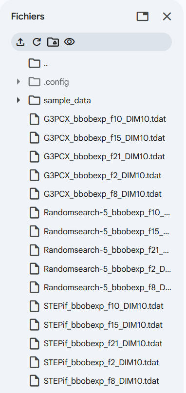
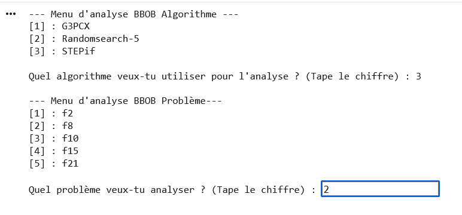

# Analyse Expérimentale et Benchmarking d'Algorithmes d'Optimisation (COCO/BBOB)

Ce dépôt contient les travaux réalisés par **Guillaume Brun** et **Cylien Lehir** dans le cadre du séminaire scientifique de l'EILCO. L'objectif est d'analyser et de comparer les performances des algorithmes **G3PCX**, **STEPif** et **RandomSearch-5**.

## Reproductibilité
Ce projet est conçu pour être entièrement reproductible par n'importe qui. Les analyses reposent sur des jeux de données générés via le benchmark BBOB (Black-Box Optimization Benchmarking).

### Configuration requise
L'analyse a été effectuée avec **Python**. Les bibliothèques suivantes sont nécessaires :
* `pandas` : pour le traitement des données (ffill, isolation des runs).
* `matplotlib` : pour la génération des graphiques de convergence.
* `numpy` : pour les calculs statistiques (médiane, IQR).

### Structure du dépôt
* `CR_Presentation_de_la_recherche_BRUN_LEHIR.pdf` : Le rapport scientifique final détaillant la méthodologie et les conclusions.
* `/scripts` : contient le notebook principal `main_analyse_G3PCX_STEPif_RandomSearch.ipynb`.
* `/figures` : regroupe toutes les figures (1 à 15) présentes dans le rapport final + les figures de convergences pour le cas de plusieurs runs.
* `/data` : l'ensemble des fichiers de données sources ainsi que les instructions pour les récupérer en ligne.

## Utilisation
1. Clonez ce dépôt.
2. Ouvrez le notebook `scripts/main_analyse_G3PCX_STEPif_RandomSearch.ipynb`.
3. Importez tous les jeux de données brutes disponibles dans le dossier `/data` comme illustré ci-dessous :

4. Exécutez les cellules pour générer les analyses de convergence pour $f_2, f_8, f_{10}, f_{15}$ et $f_{21}$ avec le menu de choix implémenté comme illustré ci-dessous :

